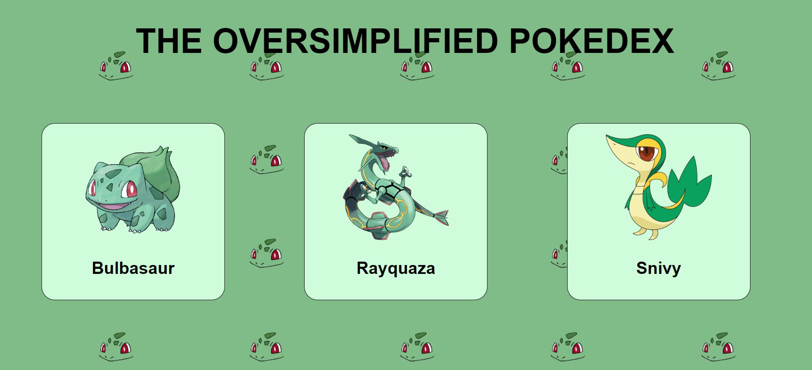

# The_Mitochondrial_Trio.io
<h3> / Introduction /   </h3>
This is the repository for our Pokedex website project developed by the Group Mitochondrial Trio. Our goal for this project is to improve the Pokedex website by further simplifying it and making the Pokedex colour coded for those who do not remember the pokemon's name.    
<h3>/ Project Scope /   </h3>
The Pokedex website will allow the users to search the pokemon's description through colour coding.  
It wil include the other features:  <li> pop up information </li> <li> colour coded background </li>
  <h3>/ Technologies Used /   </h3>
For this project, we used the following front-end technologies:  <od><li>google</li> <li>visual studio</li> <li>GIT</li> </od>
 <h3> / Installation and Setup /   </h3>
To run the Pokedex website locally, follow this steps: [jesmyn/ch'ng help please]
<h3>  / Demo /   </h3>
For life demo of our Pokedex website, visit [ https://     ]
<h3>  / Screenshot /   </h3>

<h3>  / ChatGPT Prompts and Responses /   </h3>
we did not use any, purely by hand and mind adding with a little help from css
<h3>  / Inspiration /   </h3>
we got inspired by various colours of pokemons, specifically green. Moreover, our group name : The Mitochondria Trio, has inspired us as sometimes mitochondria appears green.
<h3>  / Contributions /   </h3>
Jesmyn : Code the html and css  
Yu Shi : Brainstorming and checking the website.  
Yen Han : Does the readme and chooses pokemon.  
